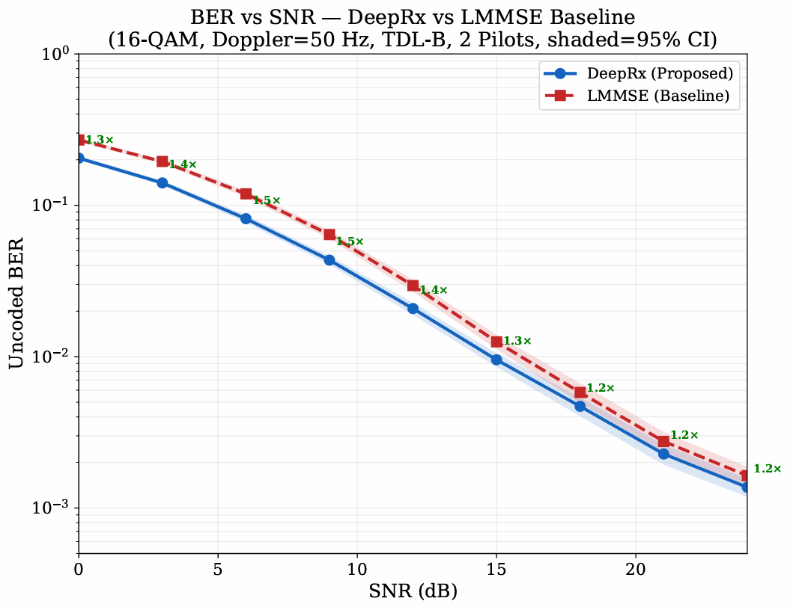
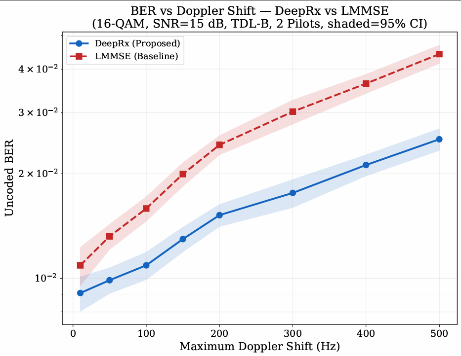
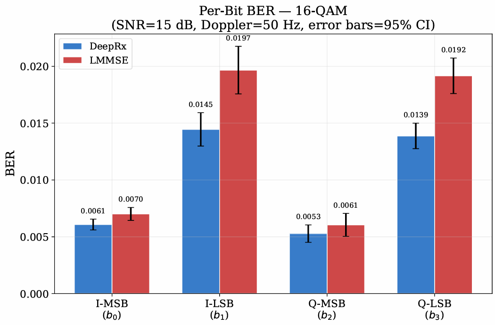

# DeepRx: Deep Learning-Based OFDM Receiver

## 📌 Overview
This project implements **DeepRx**, a deep learning-based receiver for OFDM systems using PyTorch. It provides a robust alternative to traditional receivers by using neural networks for channel estimation and signal detection.

## 📊 Performance Results

### 1. BER vs. SNR
DeepRx outperforms the traditional LMMSE receiver, especially in high SNR scenarios.
<p align="center">
  
</p>

### 2. Robustness to Doppler Shift
The model shows high stability even with high mobility (Doppler shifts up to 500 Hz).
<p align="center">
  
</p>

### 3. Per-Bit Analysis
Detailed look at the error distribution across 16-QAM bits.
<p align="center">
  
</p>

## 📂 Files
* `deeprx_model.py`: Neural network architecture.
* `ofdm_system.py`: OFDM transmitter and channel simulator.
* `train.py`: Training pipeline.
* `evaluate.py` & `plot_results.py`: Tools for testing and visualization.
## 📌 Overview
This repository contains the implementation of **DeepRx**, a Deep Learning-based receiver for Orthogonal Frequency-Division Multiplexing (OFDM) systems built with PyTorch. The project demonstrates how deep neural networks can be utilized for channel estimation, equalization, and signal detection, providing a robust alternative to traditional receivers in physical layer communications.

The performance of DeepRx is thoroughly evaluated and compared against a traditional **Linear Minimum Mean Square Error (LMMSE)** baseline receiver under various channel conditions, including AWGN and multipath fading environments (TDL channel models).

## ✨ Key Features
* **Custom Deep Learning Architecture:** Utilizes Preactivation ResNet Blocks and Depthwise Separable Convolutions for efficient and accurate signal processing.
* **Comprehensive OFDM Pipeline:** Includes QAM Modulation (QPSK, 16QAM, 64QAM, 256QAM), OFDM transmission, and realistic channel modeling with Doppler shifts.
* **Dynamic Data Generation:** On-the-fly generation of training datasets with variable SNRs and channel profiles.
* **Baseline Comparison:** Full implementation of a traditional LS/LMMSE receiver for direct Bit Error Rate (BER) comparison.
* **Publication-Quality Visualization:** Automated scripts to generate BER vs. SNR, BER vs. Doppler shift curves, and per-bit analysis.

## 📊 Performance Results

The proposed DeepRx model was evaluated under challenging conditions (16-QAM, TDL-B channel, variable SNR, and varying mobility). The results demonstrate clear advantages over the traditional LMMSE approach.

### 1. BER vs. SNR Performance
DeepRx demonstrates significant performance gains (achieving up to **1.5x** improvement) over the baseline LMMSE receiver across a wide range of Signal-to-Noise Ratios.
<p align="center">
  
</p>

### 2. Robustness to Doppler Shift
Under high mobility scenarios (simulating Doppler shifts up to 500 Hz), DeepRx maintains superior detection accuracy, proving its high robustness to rapid channel variations compared to traditional equalizers.
<p align="center">
  
</p>

### 3. Per-Bit BER Analysis
A detailed bit-level analysis reveals that DeepRx consistently lowers the Bit Error Rate across all bit positions (both Most Significant Bits and Least Significant Bits) for the I and Q components in higher-order modulations like 16-QAM.
<p align="center">
  
</p>

## 📂 Project Structure
* `deeprx_model.py`: Core DeepRx neural network architecture and custom loss functions.
* `ofdm_system.py`: Implements the OFDM transmitter, multipath channel models, and QAM modulation/demodulation.
* `traditional_receiver.py`: Baseline LMMSE receiver implementation.
* `data_generator.py`: PyTorch Dataset class for dynamic generation of training/validation OFDM symbols.
* `train.py`: The complete training pipeline with gradient accumulation and learning rate scheduling.
* `evaluate.py`: Evaluation scripts to compute BER across different SNRs and channel models.
* `plot_results.py`: Generates the publication-quality comparative plots shown above.

## 🚀 Usage

### 1. Training the Model
To train the DeepRx model from scratch:
```bash
python train.py
2. Evaluation
To evaluate the trained model's performance against the LMMSE baseline:

Bash
python evaluate.py
3. Plotting Results
To generate the performance graphs locally (saves to figures/ directory):

Bash
python plot_results.py
🛠️ Requirements
Python 3.8+

PyTorch

NumPy

Matplotlib
